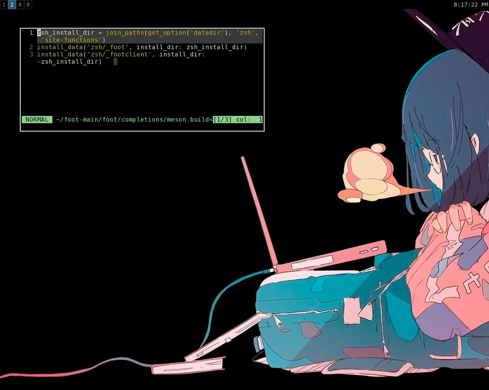

# Dante-dots

or

- OS: void(musl)
- WM: sway

In my sway config I use neutral colors in order to calmly change the desktop wallpaper without worrying about compatibility with the window manager theme.
I can change the wallpaper without any problems and change the color scheme in the terminal in two clicks

- bar: swaybar
- shell: fish(main), bash and dash
- editor: [neovim](https://github.com/jdhao/minimal_vim), libreoffice
- terminal: xfce4-terminal
- browser: chromium and firefox(main)
- fm: nnn(cli) and nemo(gui)
- audio: alsa as backend, vlc

- task manager: htop

- markdown editor: ghostwriter and ReText

- android sync: kdeconnect

- copy/past buffer: slurp and grip

- notification manager: mako
