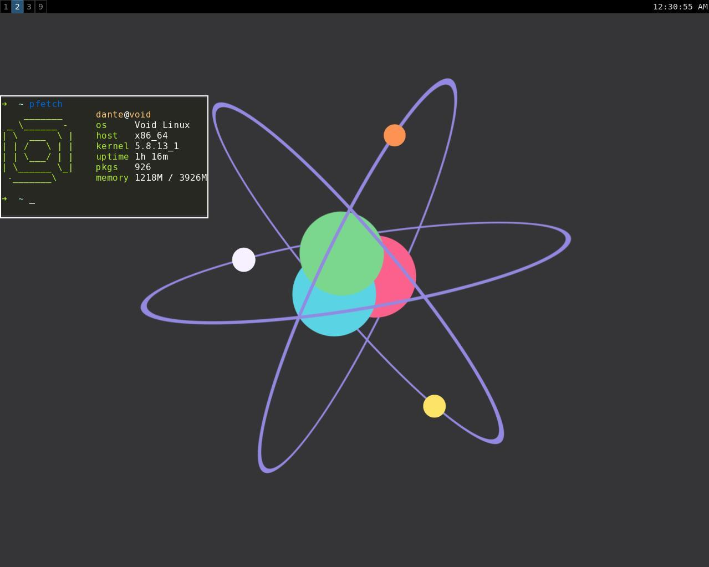

# Dante-dots

- OS: void(musl)
- WM: sway

In my sway config I use neutral colors in order to calmly change the desktop wallpaper without worrying about compatibility with the window manager theme.
I can change the wallpaper without any problems and change the color scheme in the terminal in two clicks

- bar: waybar
- shell: fish(main), bash
- editor: vim
- terminal: st
- browser: IceCat
- fm: ranger(cli) and qtfm(gui)
- audio: alsa as backend, cmus, mpv for [SomaFM](https://github.com/MS3FGX/SomaFM)
- task manager: htop
- markdown editor: ReText
- screenshot app: slurp and grip
- notification manager: mako
