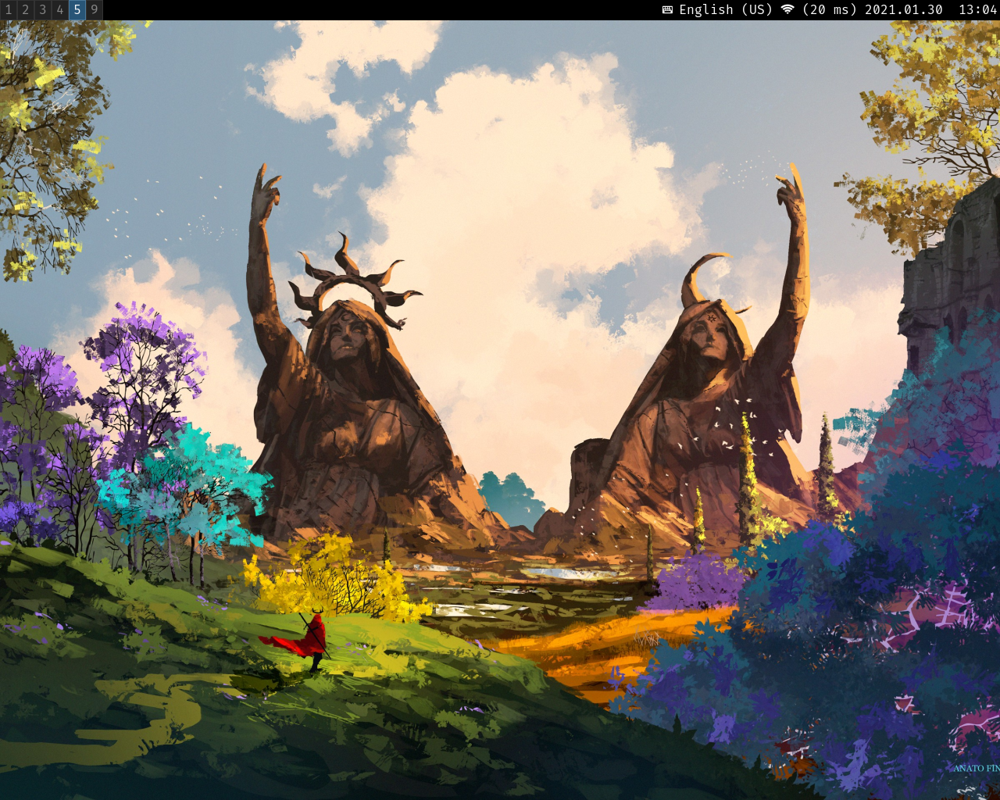
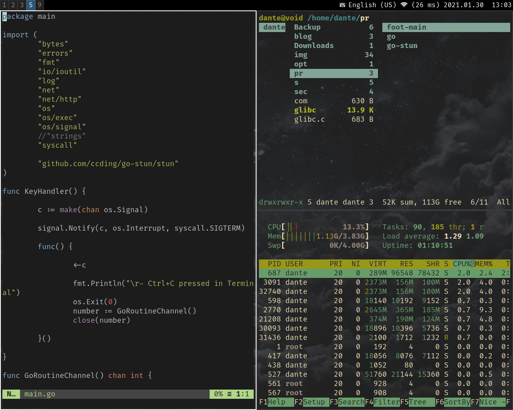
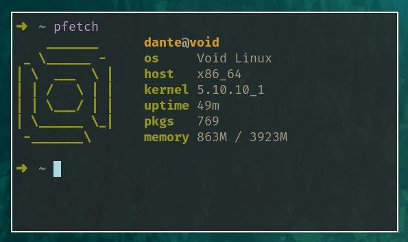
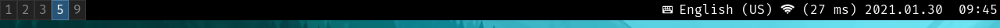
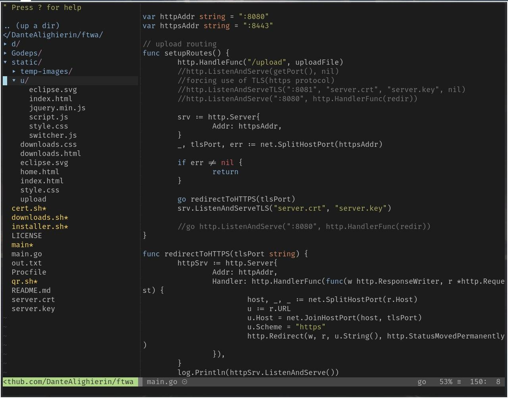
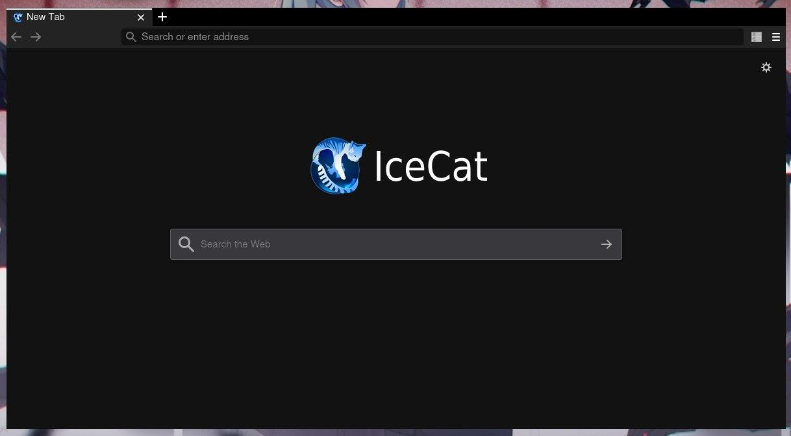
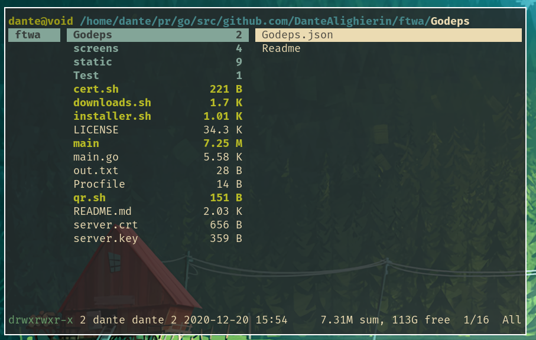
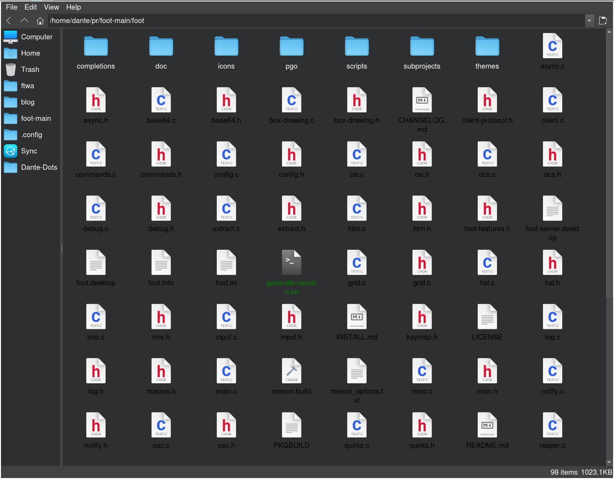
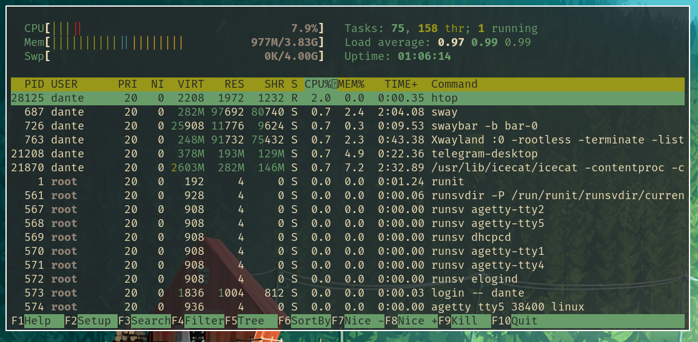
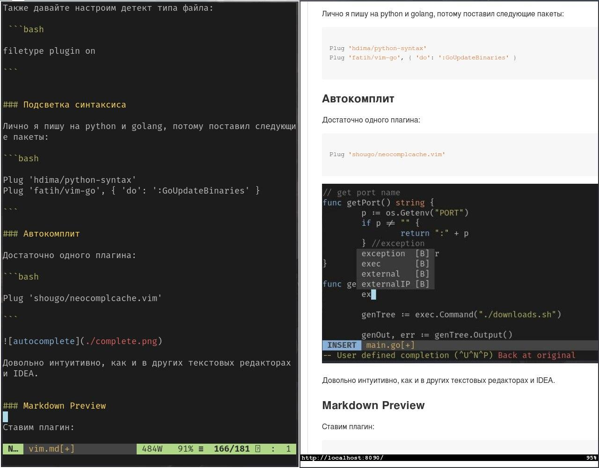

# Dante-dots

- OS: void(musl)
- WM: sway

In my sway config I use neutral colors in order to calmly change the desktop wallpaper without worrying about compatibility with the window manager theme.
I can change the wallpaper without any problems and change the color scheme in the terminal in two clicks

## Software

- bar: swaybar(as default), waybar

- shell: fish(main), bash
- editor: [vim](https://dantealighierin.github.io/comfyvim)

- terminal: st with [LukeSmith's patches](https://github.com/LukeSmithxyz/st)
- browser: IceCat

- fm: ranger(cli) and qtfm(gui)

- audio: alsa as backend, cmus, mpv for videos and [SomaFM](https://github.com/MS3FGX/SomaFM)
- task manager: htop

- markdown editor: [vim markdown plugin](https://github.com/suan/vim-instant-markdown) 

- screenshot app: slurp and grip
- notification manager: mako

## Themes

- term colorsheme: gruvbox-dark
- gtk/qt theme: [WhiteSur-dark](https://github.com/vinceliuice/WhiteSur-gtk-theme)
- icon-theme: [Whitesur-dark](https://github.com/vinceliuice/WhiteSur-icon-theme)
